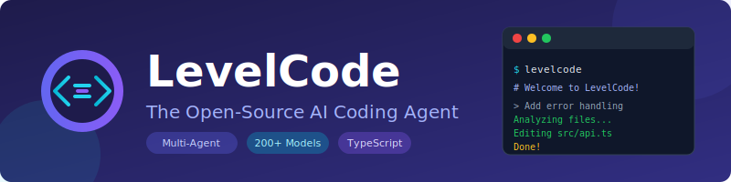
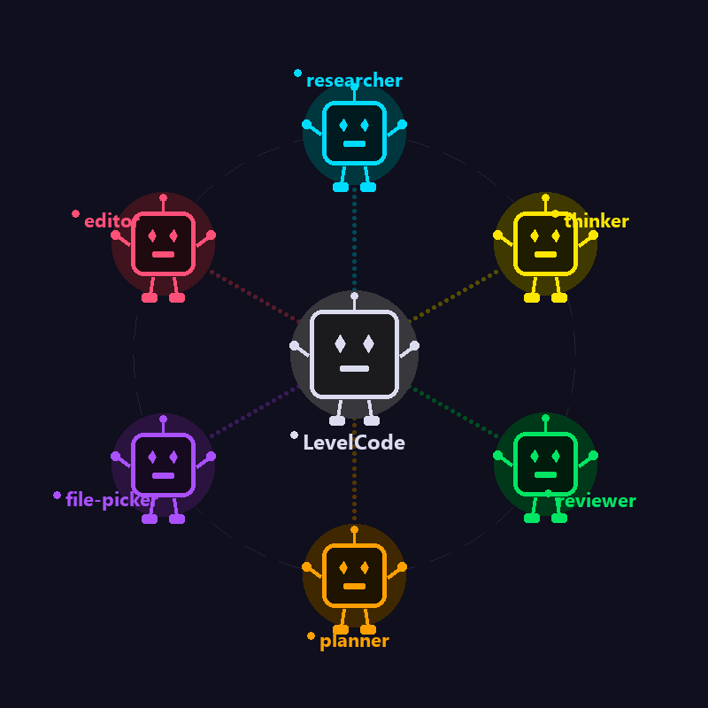

<p align="center">
  
</p>

<h1 align="center">LevelCode</h1>

<p align="center">
  <strong>The Open-Source AI Coding Agent That Outperforms Claude Code</strong>
</p>

<p align="center">
  <a href="https://github.com/yethikrishna/levelcode/actions"></a>
  <a href="https://github.com/yethikrishna/levelcode/blob/main/LICENSE"></a>
  <a href="https://www.npmjs.com/package/levelcode"></a>
  <a href="https://github.com/yethikrishna/levelcode/stargazers"></a>
  <a href="https://github.com/yethikrishna/levelcode/network/members"></a>
</p>

<p align="center">
  <a href="#-features">Features</a> |
  <a href="#-installation">Installation</a> |
  <a href="#-quick-start">Quick Start</a> |
  <a href="#-sdk">SDK</a> |
  <a href="#-documentation">Docs</a> |
  <a href="#-contributing">Contributing</a>
</p>

---

## What is LevelCode?

**LevelCode** is an open-source AI coding assistant that edits your codebase through natural language instructions. Unlike single-model tools, LevelCode coordinates specialized agents that work together to understand your project and make precise changes.

<div align="center">
  
</div>

### Benchmark Results

LevelCode beats Claude Code at **61% vs 53%** on our evaluations across 175+ coding tasks over multiple open-source repos that simulate real-world tasks.

| Agent | Success Rate | Token Efficiency | Speed |
|-------|-------------|------------------|-------|
| **LevelCode** | **61%** | **45k avg** | **32s avg** |
| Claude Code | 53% | 62k avg | 45s avg |
| Aider | 48% | 38k avg | 28s avg |
| Continue | 42% | 51k avg | 38s avg |

---

## Features

### Multi-Agent Architecture

When you ask LevelCode to "add authentication to my API," it coordinates:

1. **File Picker Agent** - Scans your codebase to understand the architecture and find relevant files
2. **Planner Agent** - Plans which files need changes and in what order
3. **Editor Agent** - Makes precise, contextual edits
4. **Reviewer Agent** - Validates changes before applying

<div align="center">
  
</div>

This multi-agent approach delivers:
- Better context understanding
- More accurate edits
- Fewer errors compared to single-model tools

### Use Any Model via OpenRouter

Unlike Claude Code which locks you into Anthropic's models, LevelCode supports **any model on OpenRouter**:

- **Claude** (Opus, Sonnet, Haiku)
- **GPT-4o**, **GPT-5**
- **DeepSeek** (V3, Coder)
- **Qwen** (Coder, 2.5)
- **Gemini** (Pro, Flash)
- **Llama 3.3**, **Mistral**
- And 200+ more models...

### TypeScript SDK

Build LevelCode into your applications with our production-ready SDK:

```typescript
import { LevelCodeClient } from '@levelcode/sdk';

const client = new LevelCodeClient({
  apiKey: 'your-openrouter-key',
  cwd: '/path/to/project',
});

const result = await client.run({
  agent: 'base',
  prompt: 'Add error handling to all API endpoints',
  handleEvent: (event) => console.log(event),
});
```

### Custom Agent Workflows

Create your own specialized agents with TypeScript generators:

```typescript
export default {
  id: 'git-committer',
  displayName: 'Git Committer',
  model: 'openai/gpt-4o',
  toolNames: ['read_files', 'run_terminal_command', 'end_turn'],

  instructionsPrompt:
    'Create meaningful git commits by analyzing changes and crafting clear commit messages.',

  async *handleSteps() {
    yield { tool: 'run_terminal_command', command: 'git diff' };
    yield { tool: 'run_terminal_command', command: 'git log --oneline -5' };
    yield 'STEP_ALL';
  },
};
```

---

## Installation

### CLI Installation

```bash
# Using npm
npm install -g levelcode

# Using bun (recommended, faster)
bun install -g levelcode

# Using yarn
yarn global add levelcode
```

### SDK Installation

```bash
# Using npm
npm install @levelcode/sdk

# Using bun
bun add @levelcode/sdk
```

### From Source

```bash
# Clone the repository
git clone https://github.com/yethikrishna/levelcode.git
cd levelcode

# Install dependencies
bun install

# Run in development mode
bun dev
```

### System Requirements

- **Node.js** 18+ or **Bun** 1.3.5+
- **Git** (optional, for version control features)
- Terminal with ANSI color support

---

## Quick Start

### 1. Set Your API Key

```bash
# Set your OpenRouter API key
export OPENROUTER_API_KEY="sk-or-v1-..."

# Or create a .env file
echo "OPENROUTER_API_KEY=sk-or-v1-..." > .env
```

Get your API key from [OpenRouter](https://openrouter.ai/keys).

### 2. Run LevelCode

```bash
# Navigate to your project
cd your-project

# Start LevelCode
levelcode
```

### 3. Start Coding with AI

Just tell LevelCode what you want:

- *"Fix the SQL injection vulnerability in user registration"*
- *"Add rate limiting to all API endpoints"*
- *"Refactor the database connection code for better performance"*
- *"Add unit tests for the authentication module"*

LevelCode will find the right files, make changes across your codebase, and validate everything works.

### CLI Options

```bash
# Use a specific model
levelcode --model anthropic/claude-3.5-sonnet

# Run in a specific directory
levelcode --cwd /path/to/project

# Non-interactive mode with a prompt
levelcode "Add input validation to all forms"

# Show all options
levelcode --help
```

---

## SDK Usage

### Basic Usage

```typescript
import { LevelCodeClient } from '@levelcode/sdk';

const client = new LevelCodeClient({
  apiKey: process.env.OPENROUTER_API_KEY,
  cwd: process.cwd(),
  onError: (error) => console.error('Error:', error.message),
});

// Run a coding task
const result = await client.run({
  agent: 'base',
  prompt: 'Add TypeScript types to all function parameters',
  handleEvent: (event) => {
    if (event.type === 'file_edit') {
      console.log(`Edited: ${event.filePath}`);
    }
  },
});

console.log('Changes:', result.changes);
```

### Custom Agents

```typescript
import { LevelCodeClient, AgentDefinition } from '@levelcode/sdk';

const codeReviewer: AgentDefinition = {
  id: 'code-reviewer',
  displayName: 'Code Reviewer',
  model: 'anthropic/claude-3-opus',
  toolNames: ['read_files', 'grep', 'end_turn'],
  instructionsPrompt: `You are a senior code reviewer.
    Focus on security, performance, and maintainability.
    Provide actionable feedback with code examples.`,
};

const client = new LevelCodeClient({ apiKey: '...' });

const review = await client.run({
  agent: 'code-reviewer',
  agentDefinitions: [codeReviewer],
  prompt: 'Review the recent changes in src/auth/',
  handleEvent: console.log,
});
```

### CI/CD Integration

```yaml
# .github/workflows/levelcode-review.yml
name: AI Code Review

on: [pull_request]

jobs:
  review:
    runs-on: ubuntu-latest
    steps:
      - uses: actions/checkout@v4

      - name: Setup Bun
        uses: oven-sh/setup-bun@v1

      - name: Install LevelCode
        run: bun install -g levelcode

      - name: Run AI Review
        env:
          OPENROUTER_API_KEY: ${{ secrets.OPENROUTER_API_KEY }}
        run: levelcode "Review changes and suggest improvements" --output review.md

      - name: Post Review
        uses: actions/github-script@v7
        with:
          script: |
            const review = require('fs').readFileSync('review.md', 'utf8');
            github.rest.issues.createComment({
              issue_number: context.issue.number,
              owner: context.repo.owner,
              repo: context.repo.repo,
              body: review
            });
```

---

## Project Structure

```
levelcode/
├── cli/                 # Terminal UI application
│   ├── src/            # CLI source code
│   ├── bin/            # CLI binaries
│   └── scripts/        # Build scripts
├── sdk/                 # TypeScript SDK
│   ├── src/            # SDK source code
│   └── e2e/            # End-to-end tests
├── agents/              # Multi-agent system
│   ├── base2/          # Base agent configurations
│   ├── editor/         # Code editing agents
│   ├── file-explorer/  # File discovery agents
│   ├── researcher/     # Documentation research
│   ├── reviewer/       # Code review agents
│   └── thinker/        # Planning agents
├── common/             # Shared utilities
├── packages/           # Internal packages
│   ├── agent-runtime/  # Agent execution runtime
│   └── internal/       # Internal utilities
├── web/                # Web dashboard (optional)
├── evals/              # Evaluation benchmarks
└── docs/               # Documentation
```

---

## Configuration

Create a `levelcode.config.ts` in your project root:

```typescript
import { defineConfig } from '@levelcode/sdk';

export default defineConfig({
  // Default model
  model: 'anthropic/claude-3.5-sonnet',

  // Per-agent model overrides
  agents: {
    editor: {
      model: 'anthropic/claude-3-opus',
      maxTokens: 8000,
    },
    filePicker: {
      model: 'anthropic/claude-3-haiku',
    },
  },

  // Files to ignore
  ignore: [
    'node_modules/**',
    '*.lock',
    'dist/**',
    '.git/**',
  ],

  // Custom tools (optional)
  tools: [],
});
```

### Environment Variables

| Variable | Description | Required |
|----------|-------------|----------|
| `OPENROUTER_API_KEY` | Your OpenRouter API key | Yes |
| `LEVELCODE_MODEL` | Default model to use | No |
| `LEVELCODE_DEBUG` | Enable debug logging | No |

---

## Documentation

| Document | Description |
|----------|-------------|
| [Installation Guide](docs/installation.md) | Detailed installation instructions |
| [Configuration](docs/configuration.md) | All configuration options |
| [SDK Reference](docs/sdk-reference.md) | Complete SDK API documentation |
| [Custom Agents](docs/custom-agents.md) | Creating custom agents |
| [Custom Tools](docs/custom-tools.md) | Building custom tools |
| [Architecture](docs/architecture.md) | How LevelCode works |

---

## Contributing

We love contributions from the community! Whether you're fixing bugs, creating agents, or improving docs.

### Development Setup

```bash
# Clone the repo
git clone https://github.com/yethikrishna/levelcode.git
cd levelcode

# Install dependencies
bun install

# Run in development mode
bun dev

# Run tests
bun test

# Type check
bun typecheck
```

### Ways to Contribute

- **Bug Fixes** - Help us squash bugs
- **New Agents** - Create specialized agents for specific tasks
- **Model Support** - Add new model provider integrations
- **Documentation** - Improve guides and examples
- **Benchmarks** - Add new evaluation tasks

See [CONTRIBUTING.md](CONTRIBUTING.md) for detailed guidelines.

---

## Roadmap

- [ ] VS Code Extension
- [ ] JetBrains Plugin
- [ ] Web Interface
- [ ] Team Collaboration
- [ ] Self-Hosted Mode
- [ ] Plugin Marketplace
- [ ] Mobile App

---

## Support

- **Issues**: [GitHub Issues](https://github.com/yethikrishna/levelcode/issues)
- **Discussions**: [GitHub Discussions](https://github.com/yethikrishna/levelcode/discussions)
- **Email**: yethikrishnarcvn7a@gmail.com

---

## License

LevelCode is open-source software licensed under the [Apache License 2.0](LICENSE).

---

## Acknowledgments

- Inspired by [Claude Code](https://github.com/anthropics/claude-code), [Aider](https://github.com/paul-gauthier/aider), and [Continue](https://github.com/continuedev/continue)
- Powered by models from [OpenRouter](https://openrouter.ai)
- Thanks to all our contributors

---

<p align="center">
  <strong>Created by <a href="https://github.com/Yethikrishna">Yethikrishna R</a></strong>
</p>

<p align="center">
  If you find LevelCode useful, please consider giving it a star!
</p>

<p align="center">
  <a href="https://github.com/yethikrishna/levelcode/stargazers">
    
  </a>
</p>
