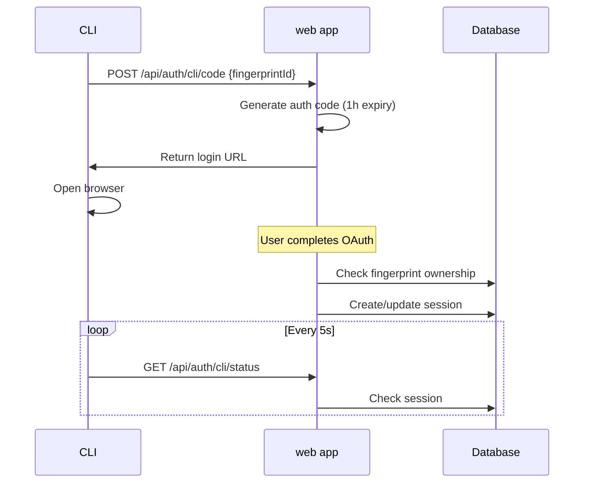

# Authentication Flow for LevelCode

## Overview

LevelCode implements secure authentication between the CLI and web application using fingerprint-based device identification.

## Core Authentication Flow

## Entry Points

### 1. First Time Login / Missing Credentials

- CLI generates fingerprint from hardware info + 8 random bytes
- Uses `calculateFingerprint()` in the SDK
- Continues to core flow with new fingerprintId

### 2. Logout Flow

- CLI calls POST `/api/auth/cli/logout`
- Deletes session from database
- Resets fingerprint `sig_hash` to null (unclaimed)
- Deletes local `credentials.json`

## Exit Points

### 1. Success: New Device

- Web creates fingerprint record in database
- Creates new session with fingerprint_id
- Returns user credentials to CLI

### 2. Success: Known Device

- Web finds existing fingerprint
- Verifies ownership via `sig_hash` match or null value
- Updates/creates session
- Returns user credentials to CLI

### 3. Failure: Ownership Conflict

- Fingerprint exists with different `sig_hash`
- Logs security event
- Returns authentication error

### 4. Failure: Invalid/Expired Code

- Auth code validation fails or expired (1h limit)
- Returns authentication error

## Security Features

- Auth codes expire after 1 hour
- Fingerprint uniqueness: hardware info + 8 random bytes
- Ownership conflicts blocked and logged
- Sessions linked to fingerprint_id in database
- Logout resets fingerprint to unclaimed state

## Key Database Tables

- `fingerprint`: Stores device fingerprints with `sig_hash` for ownership
- `session`: Links users to fingerprints with expiration
- `user`: Stores user account information

## Implementation Guidelines

1. **Fingerprint Management**: Use existing fingerprintId from credentials when available, only generate new ones for first-time users
2. **Session Handling**: Sessions are tied to fingerprint_id and have expiration dates
3. **Ownership Verification**: Check `sig_hash` matches or is null before allowing access
4. **Error Handling**: Log security events for ownership conflicts and invalid attempts
