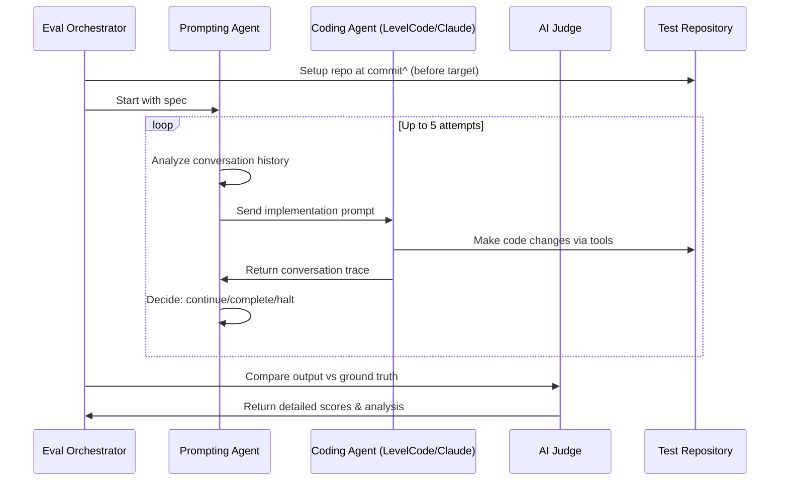

# LevelCode Evals

This directory contains the evaluation framework for testing and measuring LevelCode's coding capabilities, with a focus on the innovative **Git Commit Reimplementation Evaluation** system.

## Overview

The evaluation system takes a fundamentally different approach from traditional coding benchmarks like SWE Bench or Terminal Bench. Instead of passing predefined tests, our evaluations challenge coding agents to reimplement real git commits from open source projects over multiple interactive steps.

### Core Idea: Commit Reconstruction Methodology

Our evaluation framework centers on having coding agents reconstruct actual git commits from open source repositories through an interactive, multi-turn process.

A specialized prompting agent guides the coding agent through up to 5 conversational rounds to implement a specification derived from the original commit's changes.

The process concludes with an AI judge that provides comprehensive scoring by comparing the agent's implementation against the ground truth commit.

This methodology enables nuanced evaluation across multiple dimensions: an agent might produce functionally correct code but receive lower scores for being unnecessarily verbose, failing to leverage existing helper functions, missing edge cases present in the original implementation, or taking an inefficient path with excessive revisions and mistakes.

## Architecture

### System Components

1. **Evaluation Orchestration** (`run-git-evals.ts`, `run-eval-set.ts`)

   - Manages the complete evaluation pipeline
   - Handles concurrency and process management
   - Coordinates between all system components

2. **Agent Runners** (`runners/`)

   - **LevelCode Runner**: Integrates with local LevelCode installation
   - **Claude Runner**: Integrates with Anthropic's Claude Code
   - **Runner Interface**: Common abstraction for all coding agents

3. **Prompting Agent** (`prompting-agent.ts`)

   - Acts as the "human developer" in the loop
   - Analyzes conversation history and decides next actions
   - Generates follow-up prompts to guide the coding agent
   - Makes decisions: `continue`, `complete`, or `halt`

4. **Judging System** (`judge-git-eval.ts`)

   - Uses AI (Gemini 2.5 Pro) to score implementations
   - Compares agent output against ground truth git diffs
   - Provides detailed scoring across multiple dimensions
   - Runs 3 judges in parallel and takes median for robustness

5. **Test Repository Management** (`setup-test-repo.ts`)
   - Clones and manages git repositories for testing
   - Handles commit checkout and environment setup
   - Provides isolated testing environments

### Evaluation Workflow



## Key Features

### Multi-Step Interactive Process

- **Up to 5 conversation turns** between prompting agent and coding agent
- **Adaptive prompting** based on conversation history and progress
- **Early termination** when task is complete or off-track

### Comprehensive Scoring

The AI judge evaluates four key dimensions:

- **Completion Score (0-10)**: How completely was the spec implemented compared to ground truth?
- **Efficiency Score (0-10)**: How efficiently did the agent work without unnecessary steps?
- **Code Quality Score (0-10)**: How well-structured and maintainable is the code?
- **Overall Score (0-10)**: Combined assessment of implementation quality

### Real-World Relevance

- Uses **actual commits from real open source projects**
- Tests on **diverse coding scenarios** and project types
- Evaluates **end-to-end coding capabilities** including tool usage

## Directory Structure

```
evals/
├── git-evals/                    # Main git commit evaluation system
│   ├── run-git-evals.ts          # Core evaluation orchestrator
│   ├── run-single-eval.ts        # CLI for running individual evals
│   ├── run-eval-set.ts           # Batch evaluation runner
│   ├── judge-git-eval.ts         # AI judging system
│   ├── post-eval-analysis.ts     # Aggregate analysis of results
│   │
│   ├── runners/                  # Agent integrations
│   │   ├── runner.ts             # Common runner interface
│   │   ├── levelcode.ts           # LevelCode agent runner
│   │   └── claude.ts             # Claude Code runner
│   │
│   ├── pick-commits.ts           # Intelligent commit selection
│   ├── gen-evals.ts              # Specification generation
│   ├── gen-repo-eval.ts          # End-to-end eval creation
│   ├── setup-test-repo.ts        # Repository management
│   ├── prompting-agent.ts        # Prompting agent logic
│   └── types.ts                  # Type definitions
│
├── scaffolding.ts                # Test environment utilities
├── test-setup.ts                 # Environment configuration
└── knowledge.md                  # Additional documentation
```

## Usage

### Running Evaluations

#### Single Evaluation

```bash
# Run a specific commit evaluation
bun run evals/git-evals/run-single-eval.ts \
  --eval-file eval-levelcode.json \
  --commit-index 0 \
  --agent base2

# Run by commit SHA
bun run evals/git-evals/run-single-eval.ts \
  --eval-file eval-manifold.json \
  --commit-sha abc123 \
  --output results.json
```

#### Batch Evaluations

```bash
# Run full evaluation set
bun run evals/git-evals/run-eval-set.ts

# Run with specific configuration
bun run evals/git-evals/run-git-evals.ts \
  eval-levelcode.json \
  output-dir \
  levelcode
```

### Multi-Agent Comparison

The evaluation system supports running multiple agents in parallel on the same eval tasks to compare their performance side-by-side. Multi-agent mode is automatically activated when you specify multiple comma-separated agents with the `--agents` flag.

#### Usage

```bash
# Compare three agents on levelcode eval set
bun run evals/git-evals/run-eval-set.ts \
  --agents base,base2,base-lite
```


### Creating New Evaluations

#### 1. Pick Commits from Repository

```bash
# Analyze repository and select good evaluation commits
bun run evals/git-evals/pick-commits.ts \
  https://github.com/user/repo \
  ./picked-commits.json \
  300
```

#### 2. Generate Evaluation File

```bash
# Create complete evaluation from picked commits
bun run evals/git-evals/gen-repo-eval.ts \
  https://github.com/user/repo \
  ./picked-commits.json \
  ./eval-output.json
```

## Evaluation Data Format

### Evaluation File Structure

```typescript
interface EvalData {
  repoUrl: string // Source repository
  testRepoName?: string // Optional repo name override
  generationDate: string // When eval was created
  initCommand?: string // Optional setup command
  evalCommits: EvalCommit[] // List of evaluation tasks
}

interface EvalCommit {
  sha: string // Target commit SHA
  spec: string // Natural language specification
  fileStates: FileState[] // Ground truth file changes
}
```

### Results Format

```typescript
interface EvalRunJudged {
  eval_commit: EvalCommit // Original evaluation task
  trace: LevelCodeTrace[] // Conversation history
  error?: string // Any execution errors
  gitDiff: string // Agent's actual changes
  durationMs: number // Execution time
  costUsd: number // API costs incurred
  judging_results: {
    // AI judge analysis
    analysis: string
    strengths: string[]
    weaknesses: string[]
    metrics: {
      completionScore: number // 0-10
      efficiencyScore: number // 0-10
      codeQualityScore: number // 0-10
      overallScore: number // 0-10
    }
  }
}
```

## Supported Coding Agents

### LevelCode Integration

- Uses the LevelCode SDK for local integration
- Supports custom agent types (base, base2, base-lite, etc.)

### Claude Code Integration

- Integrates with Anthropic's Claude Code API
- Supports bypass permissions for automated testing

### Adding New Agents

Implement the `Runner` interface in `runners/`:

```typescript
export type Runner = {
  run: (prompt: string) => Promise<{
    steps: AgentStep[]
    totalCostUsd: number
  }>
}
```

## Advanced Features

### Intelligent Commit Selection

The `pick-commits.ts` system uses AI to select high-quality evaluation commits that include substantial self-contained changes.

### Judging

- **Comprehensive analysis** including strengths, weaknesses, and specific metrics
- **Cost tracking** and performance monitoring
- **Token management** with intelligent truncation for large contexts
- **Multiple judges** (3 parallel judges with median selection)

### Post-Evaluation Analysis

The `post-eval-analysis.ts` system provides:

- **Aggregate performance metrics** across all evaluation runs
- **Problem identification** with severity and frequency analysis
- **Development recommendations** for improving agent performance
- **Trend analysis** and systematic issue detection

## Configuration

### Test Environment

- Evaluations run in isolated git repositories
- Each test gets a fresh clone at the target commit's parent
- File system mocking for safe tool execution
- Process isolation with proper cleanup

## Best Practices

### Creating Quality Evaluations

1. **Select diverse commits** representing different types of changes
2. **Ensure clear specifications** that describe observable behavior
3. **Test specifications manually** to verify implementability
4. **Balance complexity** - not too simple, not overwhelming

## Examples

The `evals/git-evals/` directory contains several example evaluation files:

- `eval-levelcode.json` - LevelCode project evaluations
- `eval-manifold.json` - Manifold prediction market evaluations
- `eval-saleor.json` - Saleor e-commerce platform evaluations

These demonstrate the evaluation format and provide ready-to-use test cases.
