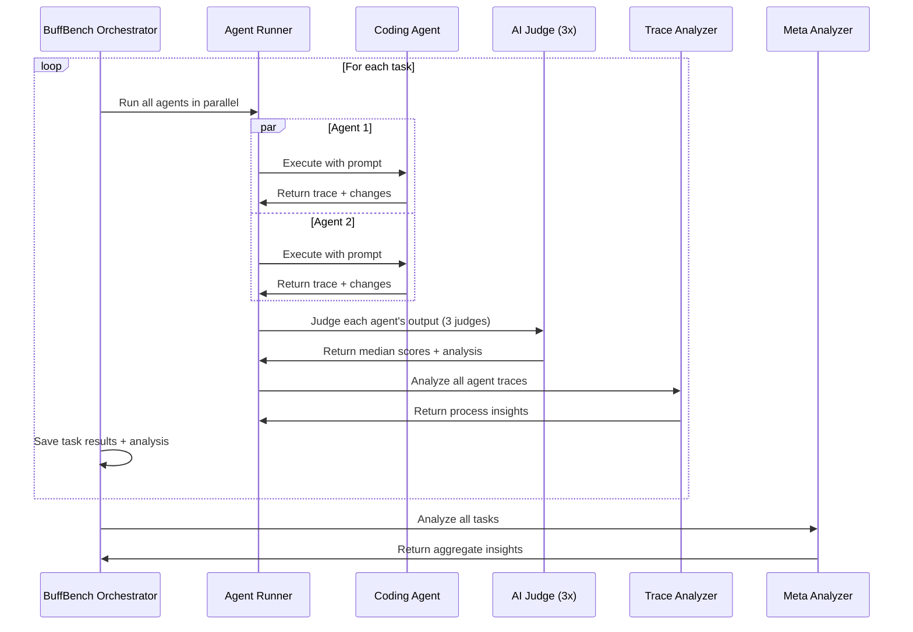

# BuffBench

BuffBench is LevelCode's evaluation framework for measuring AI coding agent performance through real-world git commit reconstruction tasks.

## Overview

BuffBench evaluates coding agents by having them reconstruct actual git commits from open source repositories. The system uses AI-powered judging to assess both the quality of implementation and the agent's problem-solving process.

### Key Features

- **Parallel Agent Comparison**: Run multiple agents simultaneously on the same tasks for direct performance comparison
- **Trace Analysis**: Deep analysis of agent execution traces to understand decision-making patterns and workflows
- **Meta-Analysis**: Aggregate analysis across all tasks to identify consistent strengths, weaknesses, and patterns
- **Structured Output**: Judges use structured output for more reliable and consistent scoring
- **Final Check Commands**: Run custom validation commands (tests, lints, etc.) after agent implementations
- **Binary Installation**: Support for installing required binaries in isolated environments
- **Enhanced Metrics**: Track completion score, code quality score, and overall score separately

## Architecture

### System Components

1. **Evaluation Orchestration** (`run-buffbench.ts`)
   - Manages the complete evaluation pipeline
   - Handles parallel execution of multiple agents on multiple tasks
   - Coordinates between agents, judges, and analyzers
   - Saves comprehensive logs and traces

2. **Agent Runner** (`agent-runner.ts`)
   - Executes coding agents in isolated test repositories
   - Captures execution traces and metrics
   - Extracts git diffs and context files
   - Runs optional validation commands

3. **Judging System** (`judge.ts`)
   - Uses AI (GPT-5) to score implementations
   - Runs 3 parallel judges and takes median for robustness
   - Compares agent output against ground truth git diffs
   - Provides detailed analysis with strengths and weaknesses
   - Scores on three dimensions: completion, code quality, and overall

4. **Trace Analyzer** (`trace-analyzer.ts`)
   - Analyzes agent execution traces after each task
   - Compares how different agents approached the same problem
   - Identifies process strengths, weaknesses, and recommendations
   - Focuses on agent workflows and decision-making patterns

5. **Meta Analyzer** (`meta-analyzer.ts`)
   - Performs aggregate analysis across all tasks
   - Identifies consistent patterns in agent behavior
   - Provides high-level insights and development priorities
   - Compares agent configurations and their impact on performance

6. **Evaluation Generation** (`gen-evals.ts`, `gen-repo-eval.ts`)
   - Generates evaluation tasks from git commits
   - Creates natural language prompts and specifications
   - Extracts file diffs and supplemental context
   - Supports batch processing of multiple commits

### Evaluation Workflow



## Key Features

### Multi-Agent Comparison

- **Parallel Execution**: Run multiple agents simultaneously on the same tasks
- **Fair Comparison**: All agents work from identical repository states
- **Comprehensive Metrics**: Compare scores, costs, duration, and success rates
- **Process Analysis**: Understand how agents differ in their problem-solving approaches

### Advanced Analysis

#### Trace Analysis (Per-Task)
After each task, the trace analyzer examines:
- How agents approached the problem
- Tool usage patterns and sequences
- Context gathering strategies
- Decision-making workflows
- Relative performance comparison

#### Meta-Analysis (Across All Tasks)
After all tasks complete, the meta analyzer identifies:
- Consistent strengths and weaknesses per agent
- Performance trends and patterns
- Cost vs quality trade-offs
- Reliability and consistency metrics
- Actionable development priorities

### Comprehensive Scoring

The AI judge evaluates three dimensions:

- **Completion Score (0-10)**: How completely was the prompt addressed?
- **Code Quality Score (0-10)**: How well-structured and maintainable is the code?
- **Overall Score (0-10)**: Combined assessment of implementation quality

### Validation Support

- **Final Check Commands**: Run tests, lints, or other validation after agent execution
- **Binary Installation**: Install required tools (e.g., linters, test runners) in isolated environments
- **Custom Environment**: Set environment variables for evaluation runs

### External CLI Agents

BuffBench supports running external CLI coding agents for comparison:

- **Claude Code**: Use `external:claude` - requires `claude` CLI installed
- **Codex**: Use `external:codex` - requires `codex` CLI installed

Example comparing LevelCode vs Claude Code:

```typescript
await runBuffBench({
  evalDataPath: 'evals/buffbench/eval-levelcode.json',
  agents: ['base2', 'external:claude'],
  taskConcurrency: 3,
})
```

### Prerequisites for External Agents

**Claude Code CLI:**
```bash
npm install -g @anthropic-ai/claude-code
# Set ANTHROPIC_API_KEY or CLAUDE_CODE_KEY environment variable
```

**Codex CLI:**
```bash
npm install -g @openai/codex
# Set OPENAI_API_KEY environment variable
```

## Directory Structure

```
evals/buffbench/
├── run-buffbench.ts          # Main orchestrator
├── main.ts                   # Example usage
├── main-nightly.ts           # Nightly evaluation runner with email reporting
├── main-single-eval.ts       # Single evaluation runner
│
├── agent-runner.ts           # Executes agents in test repos
├── judge.ts                  # AI judging system
├── trace-analyzer.ts         # Per-task trace analysis
├── meta-analyzer.ts          # Cross-task meta analysis
│
├── gen-evals.ts              # Generate eval tasks from commits
├── gen-repo-eval.ts          # End-to-end eval creation
├── eval-task-generator.ts    # Task prompt generation
│
├── format-output.ts          # Result formatting utilities
├── trace-utils.ts            # Trace processing utilities
├── lessons-extractor.ts      # Extract lessons from failures
│
├── types.ts                  # Type definitions
│
├── eval-levelcode.json        # LevelCode project evaluations
├── eval-manifold.json        # Manifold evaluations
├── eval-plane.json           # Plane project evaluations
└── eval-saleor.json          # Saleor e-commerce evaluations
```

## Usage

### Running Evaluations

#### Basic Example

```typescript
import { runBuffBench } from './run-buffbench'

await runBuffBench({
  evalDataPath: 'eval-levelcode.json',
  agents: ['base2', 'base2-fast'],
  taskConcurrency: 3,
})
```

#### Command Line

```bash
# Run evaluations
bun run evals/buffbench/main.ts

# Run single evaluation
bun run evals/buffbench/main-single-eval.ts

# Run nightly evaluation with email reporting
bun run evals/buffbench/main-nightly.ts
```

### Creating New Evaluations

#### 1. Generate from Specific Commits

```bash
bun run evals/buffbench/gen-evals.ts \
  https://github.com/user/repo \
  abc123 \
  def456 \
  ghi789
```

#### 2. Generate from Repository (End-to-End)

```bash
bun run evals/buffbench/gen-repo-eval.ts \
  https://github.com/user/repo
```

This will:
1. Clone the repository
2. Select high-quality commits using AI
3. Generate evaluation tasks for each commit
4. Save the complete evaluation file

## Evaluation Data Format

### Evaluation File Structure

```typescript
interface EvalDataV2 {
  repoUrl: string              // Source repository URL
  testRepoName?: string        // Optional repo name override
  generationDate: string       // ISO timestamp of creation
  initCommand?: string         // Optional setup command
  binInstalls?: BinInstall[]   // Binaries to install
  env?: Record<string, string> // Environment variables
  finalCheckCommands?: string[] // Validation commands
  evalCommits: EvalCommitV2[]  // List of evaluation tasks
}

interface EvalCommitV2 {
  id: string                   // Unique task identifier
  sha: string                  // Target commit SHA
  parentSha: string            // Parent commit SHA
  spec: string                 // Technical specification
  prompt: string               // Natural language prompt
  supplementalFiles: string[]  // Context files
  fileDiffs: FileDiff[]        // Ground truth changes
}

interface FileDiff {
  path: string                 // File path
  status: 'modified' | 'added' | 'deleted' | 'renamed'
  oldPath?: string             // For renamed files
  diff: string                 // Unified diff
}
```

### Results Format

```typescript
interface AgentEvalResults {
  agentId: string
  runs: EvalRun[]
  averageScore: number               // Overall score across valid runs
  averageScoreExcludingFailures: number // Score excluding failures (≤1.0)
  averageCost: number
  averageDuration: number
}

interface EvalRun {
  commitSha: string
  prompt: string
  diff: string                       // Agent's changes
  judging: JudgingResult
  cost: number
  durationMs: number
  error?: string
  finalCheckOutputs?: FinalCheckOutput[]
}

interface JudgingResult {
  analysis: string                   // Detailed analysis
  strengths: string[]
  weaknesses: string[]
  completionScore: number            // 0-10
  codeQualityScore: number           // 0-10
  overallScore: number               // 0-10
}
```

## Advanced Features

### Binary Installation

Install required binaries in isolated environments:

```json
{
  "binInstalls": [
    {
      "name": "ruff",
      "installScript": "curl -LsSf https://astral.sh/ruff/install.sh | sh -s -- --to $INSTALL_DIR",
      "binPath": "ruff"
    }
  ]
}
```

### Final Check Commands

Run validation commands after agent execution:

```json
{
  "finalCheckCommands": [
    "npm run typecheck",
    "npm test",
    "npm run lint"
  ]
}
```

### Nightly Evaluations

Run automated nightly evaluations with email reporting:

The nightly evaluation runner automatically sends email reports with results.

```bash
bun run evals/buffbench/main-nightly.ts
```

## Output Files

BuffBench creates a timestamped logs directory for each run:

```
logs/YYYY-MM-DDTHH-MM_agent1_vs_agent2/
├── 1-task-id-agent1-abc123.json      # Agent 1 trace for task 1
├── 1-task-id-agent2-abc123.json      # Agent 2 trace for task 1
├── 1-task-id-ANALYSIS-abc123.json    # Trace analysis for task 1
├── 2-task-id-agent1-def456.json      # Agent 1 trace for task 2
├── 2-task-id-agent2-def456.json      # Agent 2 trace for task 2
├── 2-task-id-ANALYSIS-def456.json    # Trace analysis for task 2
└── FINAL_RESULTS.json                # Complete results + meta-analysis
```

### FINAL_RESULTS.json Structure

```json
{
  "metadata": {
    "timestamp": "2024-01-15T10:30:00.000Z",
    "evalDataPath": "eval-levelcode.json",
    "agentsTested": ["base2", "base2-fast"],
    "commitsEvaluated": 10,
    "logsDirectory": "logs/..."
  },
  "metaAnalysis": {
    "overallComparison": "...",
    "agentInsights": [...],
    "keyFindings": [...]
  },
  "base2": {
    "agentId": "base2",
    "runs": [...],
    "averageScore": 7.5,
    "averageCost": 0.0234,
    "averageDuration": 45000
  },
  "base2-fast": {...}
}
```

## Configuration

### Environment Variables

```bash
# Required
LEVELCODE_API_KEY=your-api-key

# Optional
EVAL_RESULTS_EMAIL=team@levelcode.vercel.app  # For nightly email reports
```

### Task Concurrency

Control parallel execution:

```typescript
taskConcurrency: 1   // Sequential (safest, slowest)
taskConcurrency: 3   // Moderate parallelism
taskConcurrency: 10  // High parallelism (faster, more resources)
```

## Examples

The `evals/buffbench/` directory contains several example evaluation files:

- **eval-levelcode.json** - LevelCode project evaluations
- **eval-manifold.json** - Manifold prediction market evaluations
- **eval-plane.json** - Plane project management evaluations
- **eval-saleor.json** - Saleor e-commerce platform evaluations

These demonstrate the evaluation format and provide ready-to-use test cases.
