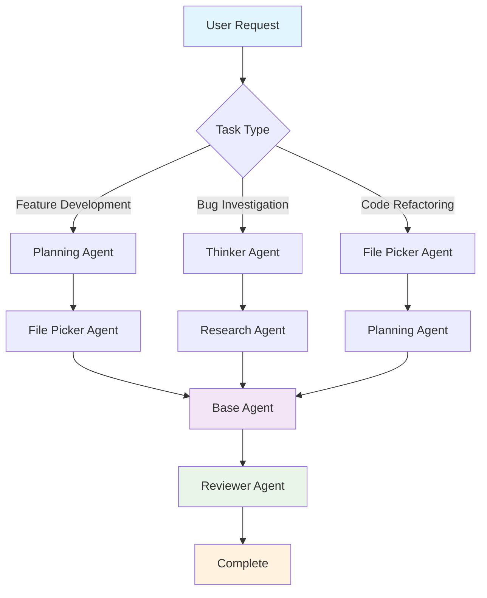

# Overview

## Why Multiple Agents?

Codebuff agents spawn other agents, share tools, and pass context between tasks:

- **Code Generation** - writes code
- **Review** - catches bugs and style issues
- **Research** - finds docs and examples
- **Planning** - breaks down requirements
- **File Discovery** - navigates codebases

## Programmatic Control

Control agents with TypeScript generator functions. Orchestrate workflows, branch on file contents, and make steps deterministic instead of hoping a prompt lands the right way.

## Built-in Agents

- [`codebuff/base`](/publishers/codebuff/agents/base) - Main coding assistant (orchestrates other agents)
- [`codebuff/editor`](/publishers/codebuff/agents/editor) - Code editing and file modifications
- [`codebuff/reviewer`](/publishers/codebuff/agents/reviewer) - Code review and feedback
- [`codebuff/thinker`](/publishers/codebuff/agents/thinker) - Deep thinking and problem analysis
- [`codebuff/researcher`](/publishers/codebuff/agents/researcher) - Web search and documentation lookup
- [`codebuff/file-picker`](/publishers/codebuff/agents/file-picker) - File discovery in your codebase
- [`codebuff/commander`](/publishers/codebuff/agents/commander) - Terminal command execution
- [`codebuff/code-searcher`](/publishers/codebuff/agents/code-searcher) - Search patterns in code files

Browse all available agents at the [Agent Store](https://codebuff.com/store).

## Agent Workflow

A typical call to Codebuff may result in the following flow:



### Example: Authentication System Refactoring

If you ask "refactor this authentication system", Codebuff might:

1. **File Picker** finds auth-related files
2. **Research** looks up best practices
3. **Planning** creates step-by-step plan
4. **Base** implements changes informed by the previous agents
5. **Reviewer** checks for security issues

### Agent Coordination

Agents coordinate through the `spawnerPrompt` field, which tells others when to spawn them. Agents can spawn others listed in `spawnableAgents`.

## Quick Start

Start Codebuff and run the `/init` command to set up your project:

```bash
codebuff
```

Then inside the CLI:

```
/init
```

1. **[Customize existing agents](/docs/agents/customizing-agents)** - Modify prompts and tools
2. **[Create new agents](/docs/agents/creating-new-agents)** - Build specialized functionality
3. **[Reference guide](/docs/agents/agent-reference)** - Complete field documentation
